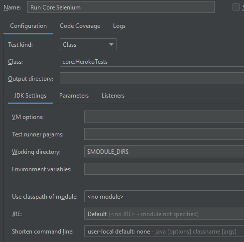

## Sample Selenium
A sample project using various automation libraries for web and mobile test execution using TestNG.

    library-common
    library-selenium

### Set up

- Clone the repo  (https://github.com/Accenture/atom.git)
- Import/Open `sample-selenium` project in IDE (gradle refresh to pull the respective dependencies) 
- Download and save the chromedriver on `<project folder path>\lib\drivers\windows` (if OS is windows)

### Test Execution
- Running test using Runner Class (TestNG)

- Running test using TestNG XML
    - Select `Template -> TestNG` and enter below details as shown in screenshot below.

##### Intellij configuration - Edit Configurations VM Options
    Name                    :   testNG
    Test Kind               :   Suite
    Suite                   :   src/test/resources/browsertests.xml
    VM Options              :   -Dcukes.env=devtest
                                -Dcukes.techstack=LOCAL_CH
                                -Dorg.apache.logging.log4j.level=DEBUG
                                -Dcukes.selenium.defaultFindRetries=1
    Shorten command line    :   classpath file

Note: to run the test in another browser update the run config (LOCAL_IE - Internet Explorer, LOCAL_FF - Firefox etc) and copy the respective driver in drivers folder.
Include below VM options to download the chromedriver during runtime.  

    -Dcukes.chromeDriver=80.0.3987.106
    -Dcukes.webdrivermanager=true

Note: For this project libraries code is directly used instead of libraries jar. 
